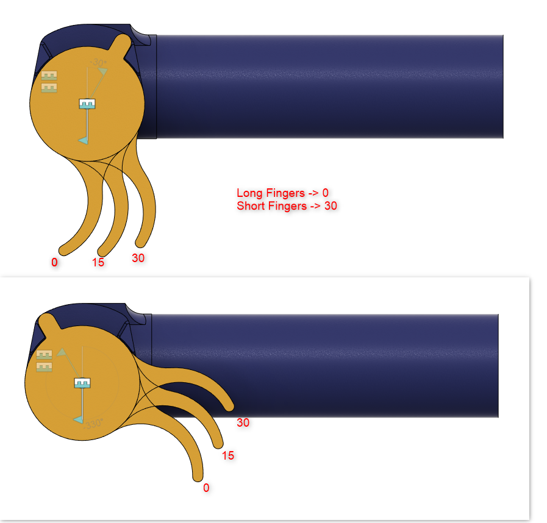

## Print settings:
- All parts are already in correct orientation for printing!
- Only Main_Body needs support.
- Nozzle Dia 0.4mm
- Layer Height 0.2mm
- First Layer 0.3mm
- 3 outer layers
- PETG recommended.

## What to do:
- Print "AllTheSmallThings", Handle, MainBodies.
- Trigger:
	- There are 3 trigger angles, see image below
	- Righthander: Print Trigger once
	- Lefthander: Mirror Trigger and print once
- Print "AllTools" for easier assembly

These are the different trigger angles:
