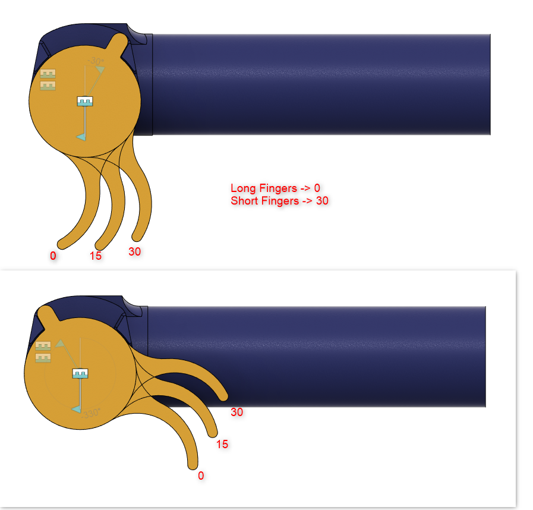

## Print settings:
- All parts are already in correct orientation for printing!
- Only Main_Body needs support.
- Nozzle Dia 0.4mm
- Layer Height 0.2mm
- First Layer 0.3mm)
- PETG recommended.

## What to do:
- Parts without numbers at the end, print 1 times
- Parts with _2x, print 2 times
- Parts with _2m, print once and once mirrored (MagRodCover and MainBody)
- For the MagRodStopper, there are 4 lenghts, try with _+02_default
	- If too tight -> use _+04, if too lose -> use _00 or _-02
- Trigger:
	- There are 3 trigger angles, see image below
	- Righthander: Print Trigger once
	- Lefthander: Mirror Trigger and print once
- Or just use the combined .stl in the "Combined" folder

These are the different trigger angles:

Special thanks to Daniel for designing and testing the "HandleBackCap_Mag"