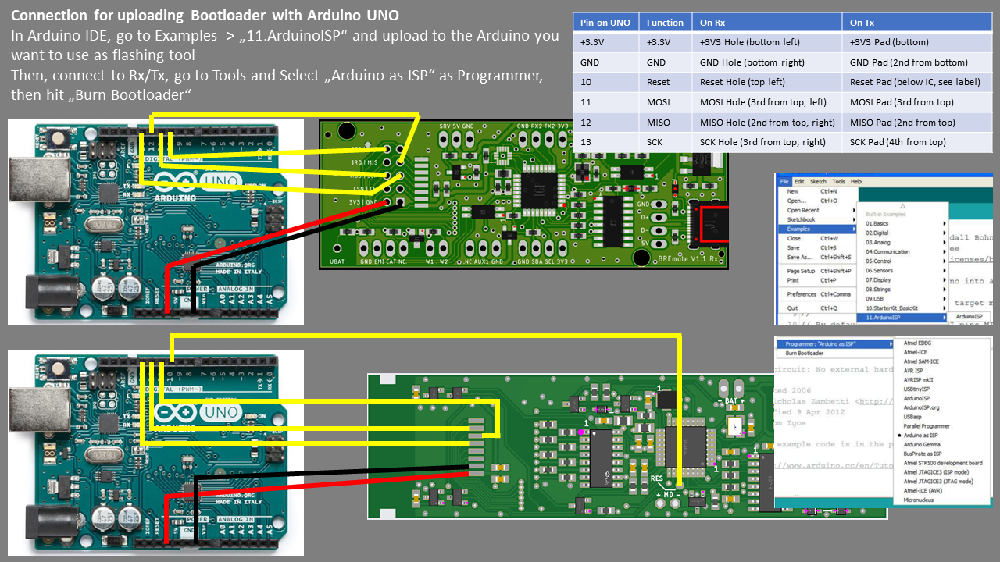
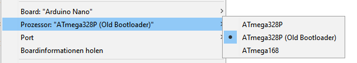

## How to upload bootloader
Before you can use Arduino IDE to flash the firmware, you need to upload the bootloader to the BREmote once!
For that, you need an AVR ISP or another Arduino.

Note: You should do this, before soldering the NRF Module in place. Just take 6 wires and solder them directly to the pads. Upload bootloader and verify success. Afterwards, desolder the wires and solder NRF module into place.

Note: If you have the accelerometer populated, flashing should be done at 3.3V (Arduino has 5V), you should use a level shifter on all SPI pins to avoid damage to the accelerometer IC.

Note: The Pinout is only valid for the "normal" Tx Version. For the Tx_LR (long range), please contact me.




## How to compile / upload

Download Arduino IDE.
In Arduino IDE, go to Sketch -> Add Library -> Search for "RF24" and Install "RF24" from TMRh20 (you'll need to scroll down a bit).



If the upload does not work, select as Board "Arduino Nano (ATMEGA328P) (OLD BOOTLOADER)"

## Software Changes
These are the most frequent changes in "SHARED_CONFIG.h":
Change this in BOTH the Tx and Rx directory!
```
uint8_t rxAddr[6] = {"BREAI"}; //From Rx To Tx (Board to Remote)
uint8_t txAddr[6] = {"BREAO"}; //From Tx To Rx (BRemote to Board)
```
* For the adresses, choose any 5-character strings you want. Make sure it is unique for everybody using a BREmote at the same time.
```
#define NO_LOCK
```
* If "NO_LOCK" is uncommented, the remote will start locked and with Powerlevel 0 as default. "NO_LOCK" will deactivate locking & start at Powerlevel 9.
```
#define FOIL_BAT_EMPTY_AT 180 //10*V (e.g. 200 = 20V)
#define FOIL_BAT_FULL_AT 220  //10*V (e.g. 200 = 20V)
```
* "FOIL_BAT_xx" will define at which voltage the VESC battery is recognized as full or empty.
This change is made in the config of Rx! DO NOT change the INT_VBAT_xx in Tx!
This is in 10*Voltage, Example values (2.5V/4.2V):

| Series Pack | EMPTY_AT | FULL_AT |
| --- | --- | --- |
| 10S | 250 | 420 |
| 12S | 300 | 504 |
| 14S | 350 | 588 |
| 16S | 400 | 672 |
| 18S | 450 | 756 |
| 20S | 500 | 840 |